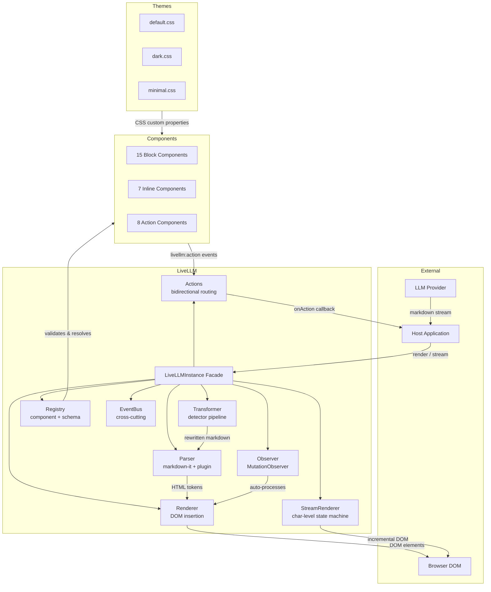
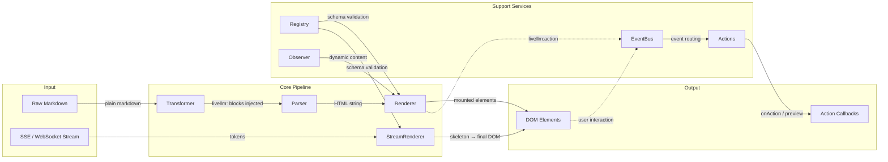
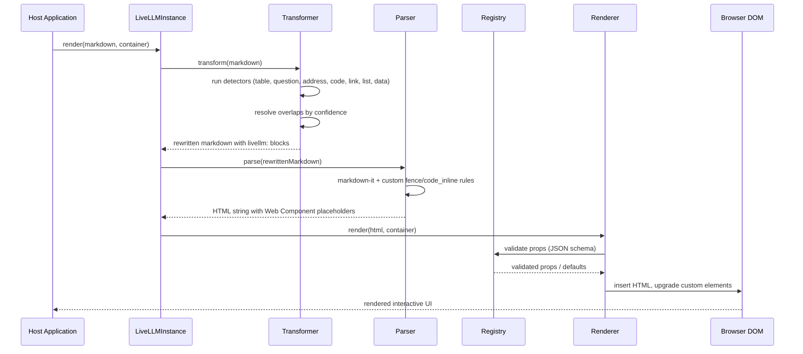
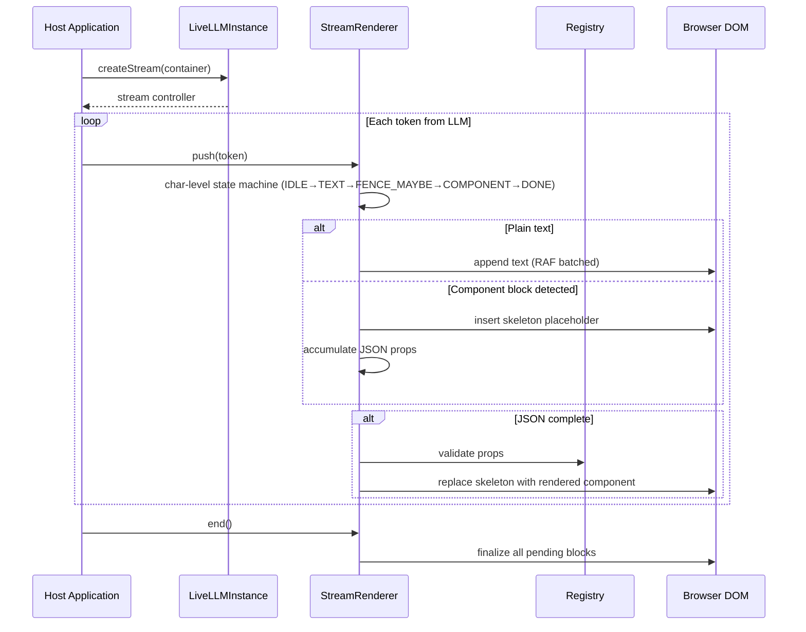
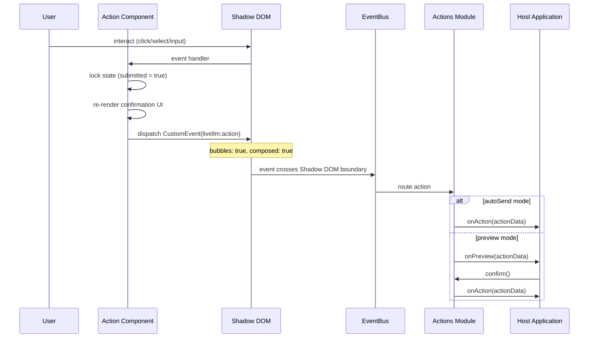
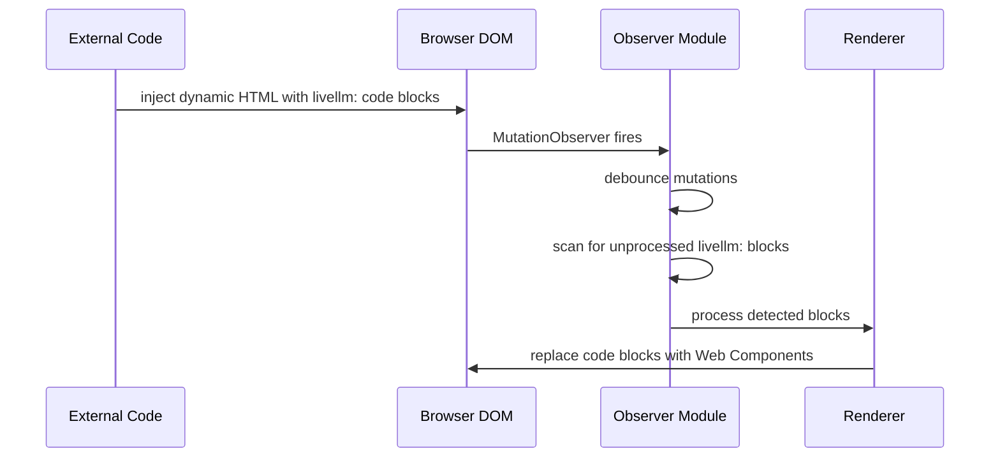
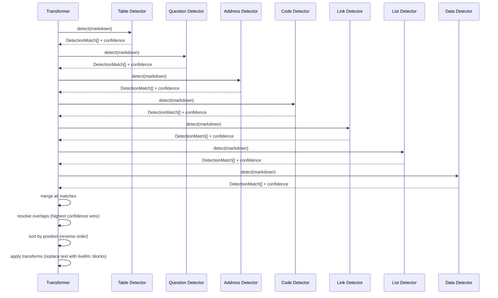
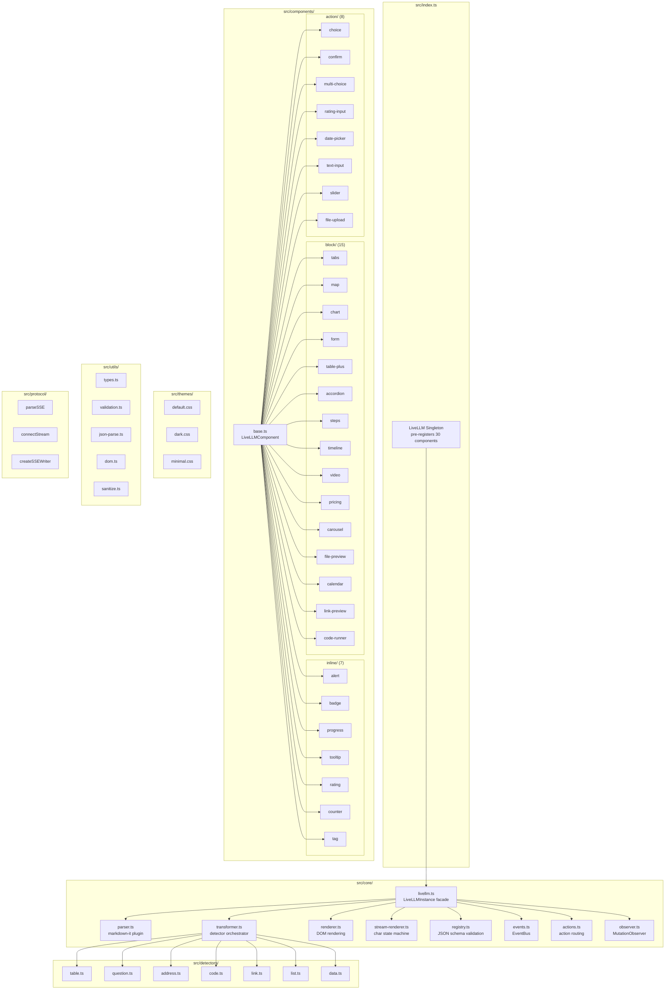

# LiveLLM — Architecture Views

> Auto-generated architecture documentation

---

### SECTION: OVERVIEW

---

### SECTION: SERVICES

---

### SECTION: FLOWS

#### Flow: Static Render

#### Flow: Token Streaming

#### Flow: Action Lifecycle

#### Flow: Observer Auto-Processing

#### Flow: Detector Pipeline

---

### SECTION: MODULES

---

### SECTION: SUMMARY

{
  "system_name": "LiveLLM",
  "description": "Framework-agnostic JavaScript library that transforms LLM markdown responses into interactive Web Component UIs. Supports streaming, auto-detection, bidirectional actions, and theming.",
  "components": [
    {"name": "LiveLLMInstance (Facade)", "type": "module", "description": "Orchestrates all core modules; singleton exported as LiveLLM with 30 pre-registered components"},
    {"name": "Parser", "type": "module", "description": "markdown-it with custom plugin intercepting livellm: fenced blocks and inline code"},
    {"name": "Transformer", "type": "module", "description": "Runs detectors over plain markdown, auto-converts patterns to livellm: blocks with overlap resolution"},
    {"name": "Renderer", "type": "module", "description": "Renders parsed HTML to DOM elements, validates props via Registry, binds action event listeners"},
    {"name": "StreamRenderer", "type": "module", "description": "Char-level state machine for token-by-token rendering with skeleton placeholders and RAF batching"},
    {"name": "Registry", "type": "module", "description": "Component registration with JSON schema prop validation, defaults, and lazy loading"},
    {"name": "EventBus", "type": "module", "description": "Cross-cutting event system (on/off/once/emit) used by all modules for communication"},
    {"name": "Actions", "type": "module", "description": "Bidirectional action routing: component events to host callbacks with autoSend or preview-confirm flow"},
    {"name": "Observer", "type": "module", "description": "MutationObserver-based auto-processing of livellm: blocks in dynamically inserted DOM content"},
    {"name": "Block Components (15)", "type": "module", "description": "Rich UI blocks: tabs, map, chart, form, table-plus, accordion, steps, timeline, video, pricing, carousel, file-preview, calendar, link-preview, code-runner"},
    {"name": "Inline Components (7)", "type": "module", "description": "Text-flow elements: alert, badge, progress, tooltip, rating, counter, tag"},
    {"name": "Action Components (8)", "type": "module", "description": "Input collectors: choice, confirm, multi-choice, rating-input, date-picker, text-input, slider, file-upload"},
    {"name": "Detectors (7)", "type": "module", "description": "Pattern detectors: table, question, address, code, link, list, data — each with confidence scoring"},
    {"name": "Themes", "type": "module", "description": "CSS custom property system with default (light), dark, and minimal themes"},
    {"name": "Protocol", "type": "module", "description": "SSE client/server helpers: parseSSE, connectStream, createSSEWriter for streaming integration"},
    {"name": "markdown-it", "type": "external", "description": "Sole production dependency (v14) — Markdown parser extended via custom plugin"}
  ],
  "features": [
    {"name": "Phase 0 — Project Setup", "status": "complete", "tasks_done": 0, "tasks_total": 0},
    {"name": "Phase 1 — Core Modules", "status": "complete", "tasks_done": 0, "tasks_total": 0},
    {"name": "Phase 2 — Streaming + Components", "status": "complete", "tasks_done": 0, "tasks_total": 0},
    {"name": "Phase 3 — Transformer Detectors", "status": "complete", "tasks_done": 0, "tasks_total": 0},
    {"name": "Phase 4 — Actions", "status": "complete", "tasks_done": 0, "tasks_total": 0},
    {"name": "Phase 5 — Ecosystem", "status": "complete", "tasks_done": 0, "tasks_total": 0},
    {"name": "feat-claude-md-project-guide", "status": "complete", "tasks_done": 0, "tasks_total": 0}
  ],
  "tech_stack": [
    "TypeScript (strict)",
    "Rollup (UMD + ESM + CJS)",
    "Vitest + happy-dom",
    "ESLint",
    "markdown-it v14",
    "Web Components (Shadow DOM)",
    "CSS Custom Properties"
  ],
  "key_decisions": [
    "Single production dependency (markdown-it) — no chart libs, no UI frameworks",
    "Shadow DOM (open mode) for style isolation across all 30 components",
    "Char-level state machine for streaming instead of regex-based chunk parsing",
    "Detector confidence scoring with overlap resolution for auto-detection",
    "One-shot action pattern: components lock after submission, no undo",
    "CSS custom properties (--livellm-*) for theming rather than CSS-in-JS",
    "Facade pattern: LiveLLMInstance orchestrates all modules behind a single API",
    "CustomEvent with bubbles + composed for crossing Shadow DOM boundaries"
  ]
}
