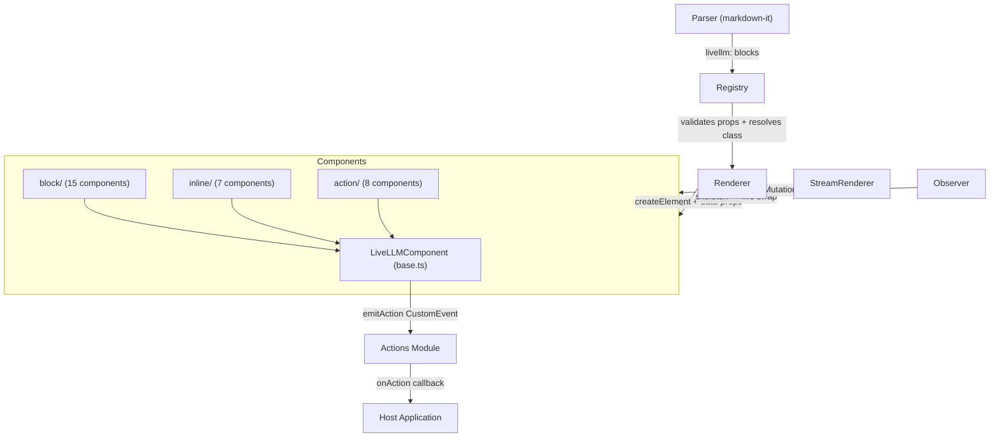

```markdown
# Spec: LiveLLM Web Components System

## Purpose
A collection of 30 framework-agnostic Web Components that render LLM markdown output as interactive UI elements. Components are self-contained Shadow DOM custom elements organized into three categories: block-level rich cards, inline prose-compatible widgets, and action components that collect user input and emit results back to the host application.

## Architecture



## Modules

**`base.ts`** — Abstract `LiveLLMComponent` class that all components extend. Handles Shadow DOM creation, `connectedCallback`/`attributeChangedCallback` lifecycle, `data-props` JSON parsing, unique ID generation, theme variable access via `getThemeVar()`, style injection via `setStyles()`, content rendering via `setContent()`, and cross-boundary action dispatch via `emitAction()` (composed + bubbling CustomEvent).

**`block/`** — Fifteen block-level card-style components for displaying rich structured content: accordion, calendar, carousel, chart (SVG-only), code-runner, file-preview, form, link-preview, map (OpenStreetMap iframe), pricing, steps, table-plus, tabs, timeline, and video. Designed for discrete full-width rendering within LLM responses.

**`inline/`** — Seven lightweight components designed for `display: inline` or `display: inline-flex` rendering within prose: alert, badge, counter, progress, rating, tag, and tooltip. Minimal in size; skeleton placeholders are fixed-size for use by StreamRenderer during token streaming.

**`action/`** — Eight one-shot interactive input components: choice, confirm, date-picker, file-upload, multi-choice, rating-input, slider, and text-input. Each locks after a single submission and emits a `livellm:action` CustomEvent with a structured payload for the host to consume.

**`index.ts`** — Barrel re-export of all 30 component classes and their registration metadata, providing a single public import surface consumed by `src/index.ts` for singleton registration.

## Key Interfaces

```ts
abstract class LiveLLMComponent extends HTMLElement {
  protected _props: Record<string, unknown>;
  protected abstract render(): void;
  protected setStyles(css: string): void;
  protected setContent(html: string): void;
  protected emitAction(action: string, data: Record<string, unknown>): void;
  protected getThemeVar(name: string, fallback?: string): string;
  protected escapeHtml(str: string): string;
}

interface RegisterOptions {
  name: string;
  category: 'block' | 'inline' | 'action';
  schema: JSONSchema;
  skeleton?: string;
  skeletonHeight?: string;
}

// Dispatched as: new CustomEvent('livellm:action', { bubbles: true, composed: true, detail: payload })
interface ActionPayload {
  value: unknown;
  label?: string;
  [key: string]: unknown;
}
```

## Data Flow

1. **Parse** — `Parser` intercepts `livellm:component-name` fenced blocks and inline code in LLM markdown, extracting JSON props.
2. **Validate** — `Registry` looks up the component class, validates props against its JSON schema.
3. **Mount** — `Renderer` creates a custom element, sets `data-props` attribute with serialized JSON.
4. **Render** — `connectedCallback` fires; component reads `data-props`, calls `render()`, injects HTML + CSS into Shadow DOM.
5. **Interact** (action components) — User interacts; component calls `emitAction(action, payload)`, dispatching a composed CustomEvent up through Shadow DOM to the document.
6. **Handle** — `Actions` module intercepts `livellm:action` at document level, routes to `onAction` callback or preview/confirm flow.
7. **Stream** — `StreamRenderer` pre-renders skeleton placeholder HTML (from `RegisterOptions.skeleton`) while tokens arrive, then swaps to live component once the block is complete.

## Dependencies

- **`../base`** (`LiveLLMComponent`) — required by all block, inline, and action components
- **`../../core/registry`** (`RegisterOptions`) — type-only import for registration metadata
- No external UI libraries; charts use raw inline SVG, maps use OpenStreetMap iframes
- CSS theming via `--livellm-*` custom properties (defined in `src/themes/`)

## Notes

- `emitAction` sets `composed: true` — mandatory for events to cross Shadow DOM boundaries and reach the `Actions` module listening at the document level.
- `setContent` preserves the `<style>` element injected by `setStyles` across re-renders to prevent style loss on prop updates.
- Component IDs are generated as `livellm-{type}-{timestamp36}-{random5}` — unique without a global counter.
- All action components implement a **one-shot** pattern: `submitted = true` on first interaction, inputs disabled, UI updates to confirmation state. No undo.
- `escapeHtml` is re-implemented locally in several components rather than using the inherited method — minor duplication worth consolidating.
- Props arrays (e.g. slides, options) accept both `string` and `{ label, value }` object formats; normalization is done inside each component.
- Block components accept aliased prop keys (e.g. `slides || items || cards || pages`) for authoring flexibility.
- `LiveLLMAlert` uses `display: block` on `:host` despite living in `inline/` — it is block-level in practice.
- Video component detects YouTube/Vimeo URLs to auto-generate embed URLs; falls back to native `<video>` for `.mp4/.webm/.ogg`.
```

Please approve the write to `specs/components.spec.md` and I'll save it.