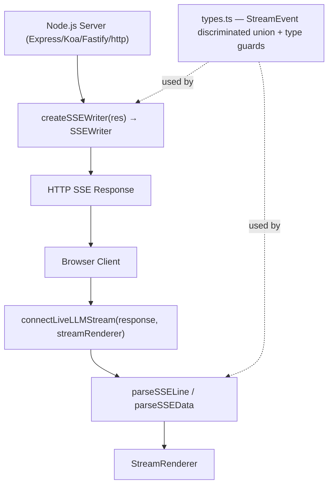

# Spec: LiveLLM Streaming Protocol — SSE Communication Contract

## Purpose
The `src/protocol/` module defines the standardized server-to-client communication contract for LiveLLM streaming. It provides typed SSE event definitions, server-side helpers for emitting protocol-compliant events, and client-side helpers for parsing SSE streams and wiring them directly to a `StreamRenderer`.

## Architecture



## Modules

**`types.ts`** — Single source of truth for all protocol types. Defines the `StreamEvent` discriminated union (`TokenEvent`, `ErrorEvent`, `MetadataEvent`, `DoneEvent`) and top-level shapes `LiveLLMResponse`, `LiveLLMActionPayload`, and `LiveLLMChatRequest`. Also exports type guards (`isStreamEvent`, `isTokenEvent`, etc.) for safe narrowing at runtime.

**`server.ts`** — Server-side helpers. `createSSEWriter()` wraps any `SSEWritable`-compatible response object (minimal `setHeader/write/end` interface) to emit protocol-compliant SSE events. `formatActionAsMessage()` converts an action payload into a natural-language string suitable for injection into LLM message history.

**`client.ts`** — Client-side helpers. `parseSSEData()` and `parseSSELine()` parse raw SSE text into typed `StreamEvent` objects. `connectLiveLLMStream()` accepts a fetch `Response`, reads its body as a stream, and routes events to a `StreamRenderer` via a local `StreamRendererLike` duck-typed interface.

**`index.ts`** — Public entry point. Re-exports everything from the three modules above as the `livellm/protocol` package entry point.

## Key Interfaces

```ts
// Discriminated union covering all SSE event shapes
type StreamEvent = TokenEvent | ErrorEvent | MetadataEvent | DoneEvent;

// Server-side writer returned by createSSEWriter()
interface SSEWriter {
  sendToken(token: string): void;
  sendMetadata(metadata: Record<string, unknown>): void;
  sendError(message: string, code?: string): void;
  sendDone(usage?: UsageInfo): void;
  end(): void;
}

// Minimal response interface — framework-agnostic
interface SSEWritable {
  setHeader(name: string, value: string): void;
  write(chunk: string): void;
  end(): void;
}

// Client-side stream connection
function connectLiveLLMStream(
  response: Response,
  streamRenderer: StreamRendererLike,
  options?: { onError?: (err: ErrorEvent) => void; onDone?: (evt: DoneEvent) => void }
): Promise<void>;
```

## Data Flow

1. Server calls `createSSEWriter(res)` and emits events (`sendToken`, `sendMetadata`, `sendError`, `sendDone`) over the HTTP response.
2. Each event is formatted as a standard SSE `data:` line containing a JSON-serialized `StreamEvent`.
3. Browser fetches the endpoint; the raw `Response` body is passed to `connectLiveLLMStream()`.
4. `connectLiveLLMStream` reads the body line-by-line, calling `parseSSELine()` → `parseSSEData()` to deserialize each event.
5. `TokenEvent` → `streamRenderer.push(token)`, `DoneEvent` → `streamRenderer.end()`, `ErrorEvent` → `streamRenderer.end()` + optional `onError` callback.
6. When an action fires in the UI, `formatActionAsMessage()` converts the `LiveLLMActionPayload` to a user-readable string for re-injection into the LLM chat history.

## Dependencies

No external runtime dependencies. Pure TypeScript. Compatible with any Node.js-compatible HTTP framework (Express, Koa, Fastify, raw `http`) via the minimal `SSEWritable` interface. Client side requires the Fetch API (`Response` + `ReadableStream`).

## Notes

- **Backwards compatibility**: `parseSSEData` handles legacy bare `{token:"..."}` objects predating the protocol, and `connectLiveLLMStream` handles both the legacy `[DONE]` plain string and the typed `{type:'done'}` event.
- **Circular import avoidance**: `client.ts` defines a local `StreamRendererLike` duck-typed interface rather than importing `StreamRenderer` from core, preventing circular dependencies.
- **Framework decoupling**: `SSEWritable` is intentionally minimal so `createSSEWriter` is not coupled to any specific HTTP framework.
- **Error safety**: Non-recoverable stream errors automatically call `streamRenderer.end()` to prevent hanging renders in the browser.
- **`formatActionAsMessage`**: Designed for LLM history injection — converts structured action payloads into human-readable messages that can be appended to a chat history array before the next LLM call.

---

Please approve the write to `specs/protocol.spec.md` to save this file.